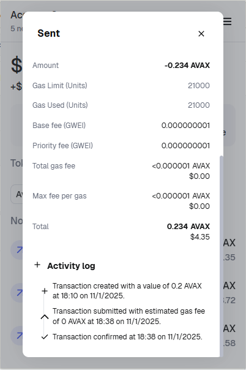

# 1. Wallet

- Metamask acc: 0x6Fc01CcC96dF05197F7F2384354ee6f5Aa086544

# 2. Chains

- Chain: **Avalanche C-Chain**
- First transaction: [Link to the transaction](https://testnet.snowscan.xyz/tx/0x90da20f5a42f92d539715587f6ab1fdd5eb66c0242e0641e7d4a47de94f438a9)

# 3. Transactions

- Inter-account transaction: [Link to the transaction](https://testnet.snowscan.xyz/tx/0x27c9c254c56c7c8e128da5e99b060a8872a65234ef64e249f9b12fa2f34dd12b)

# 4. Gas

- Mainnet gas tracker: [Link to the mainnet gas tracker](https://snowtrace.io/insight/leaderboard/gas-tracker)
- Testnet gas tracker: [Link to the testnet gas tracker](https://testnet.snowtrace.io/insight/leaderboard/gas-tracker)

# 5. Nonce

- Default value nonce transaction: [Link to the default nonce transaction](https://testnet.snowscan.xyz/tx/0x6fdeeb5355f933ffaef71c6b9a6c8baba81d3fbfef5f84534ae3b5e9f7937a72)
- Increased value nonce transaction: [Link to the increased nonce transaction](https://testnet.snowscan.xyz/tx/0xff8813ccdd7f0243795a7d70a569c36672996357cac89e07e9226752698c1249)

Default nonce activity log: 

Increased nonce activity log: 

# Source Code

All the source code is in the `module_4` folder of a GitHub repository.
You can find the repository [here](https://github.com/eugene-chekan/crypto-n-blockchain-practice/tree/main/module_4).
